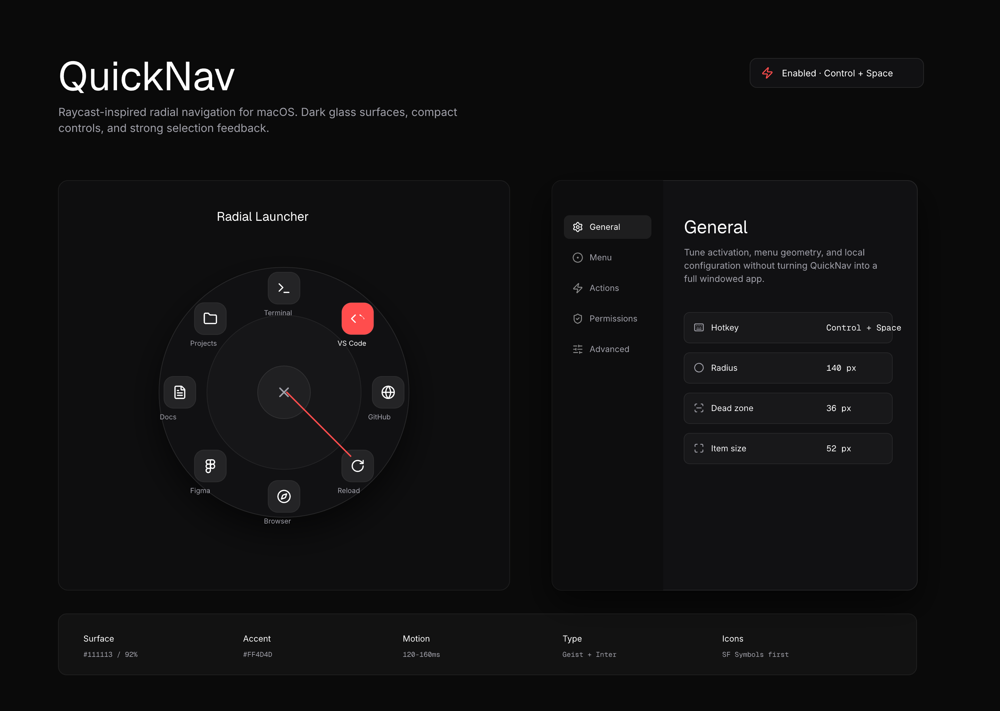

# QuickNav for Mac

QuickNav 是一个 macOS 常驻快捷导航工具。按住全局快捷键，移动到径向菜单项，松开后即可打开网址、启动应用或执行本地动作。

产品方向是轻量的个人 macOS 工具：低打扰、指针驱动的快速选择、本地 JSON 配置，以及 Raycast 风格的深色界面。



## 当前状态

- 产品需求已整理。
- 开发架构已整理。
- Raycast 风格视觉方向已整理。
- Pencil 设计探索已导出到 `docs/assets/design/quicknav-raycast-design.png`。
- 最小 SwiftPM 应用骨架已实现：菜单栏常驻、可自定义全局快捷键、隐藏光标径向导航、Pencil 风格设置窗口、配置文件入口，以及基础应用/网址/目录动作。

## 本地运行

构建应用：

```bash
swift build
```

运行菜单栏原型：

```bash
swift run QuickNav
```

启动后，macOS 右上角菜单栏会出现 `Q`。点击 `Q` 可以打开状态菜单，包括启用/停用、重载配置、打开配置文件/目录、设置、辅助功能设置、关于和退出。默认按住 `Command + Shift + D` 可以显示径向导航；也可以在「设置 > 通用」里勾选修饰键、输入 A-Z 或 0-9 主键，然后点击「应用快捷键」修改。松开触摸板或鼠标时，只有选中某个菜单项才会关闭并执行；未选中时会回到中心。松开快捷键会关闭导航，并把系统光标恢复到打开时的位置。

## 文档

- [产品需求](docs/prd.md)
- [开发计划](docs/development.md)
- [设计方向](docs/design.md)

## 项目结构

```text
quick-nav-for-mac/
├── README.md
├── docs/
│   ├── prd.md
│   ├── development.md
│   ├── design.md
│   └── assets/
│       ├── brand/
│       │   └── quicknav-clean.svg
│       ├── design/
│       │   └── quicknav-raycast-design.png
│       └── prototypes/
│           └── *.png
```

## 产品摘要

按住全局快捷键时，QuickNav 会出现在当前指针附近。系统光标会隐藏，红色圆点只在触摸板或鼠标按下拖动时移动。红点会在视觉上限制在菜单半径内，但拖动过程中不会强行移动真实光标，避免边界卡死。只有红点进入图标区域时才会选中菜单项。第一项会打开基于 Pencil `Visible settings panel` 设计的自定义设置窗口，其余内置项会打开基础应用、目录、网址或重载配置。

默认交互参数：

- 默认快捷键：`Command + Shift + D`，可在设置页自定义
- 菜单半径：`140px`
- 中心死区半径：`36px`
- 默认菜单项数量：`8`
- 角度起点：屏幕右侧
- 排列方向：顺时针

## 设计方向

界面采用 Raycast inspired 风格，但不直接复制 Raycast 的命令面板形态。径向菜单仍然是 QuickNav 的核心交互模型。

关键视觉决策：

- 深色半透明表面。
- 紧凑工具型界面。
- 高对比文字层级。
- 选中态使用红色强调。
- 通过颜色、缩放、阴影和文字对比提供明确反馈。
- 尽量使用 SwiftUI、AppKit、SF Symbols 和系统材质实现 macOS 原生体验。

## 技术栈

- Swift
- SwiftUI
- AppKit
- Carbon HotKey 或等效全局快捷键处理
- `NSEvent` / `CGEvent` 鼠标跟踪
- `NSWorkspace` 和 `Process` 动作执行
- `Codable` JSON 配置
- XCTest 覆盖角度计算、配置解析和动作校验

## 实现说明

当前原型会执行一组小型内置动作，并在 `~/Library/Application Support/QuickNav/config.json` 创建默认本地配置文件。基于 JSON 的自定义菜单编辑仍是后续步骤；当前设置面板已支持启用/停用 QuickNav、自定义全局快捷键、调整菜单几何参数、查看内置动作、打开权限设置，以及打开/重载配置文件。

## 资源说明

`docs/assets/prototypes/` 存放早期视觉参考和生成的原型图。当前实现应参考的设计图是：

```text
docs/assets/design/quicknav-raycast-design.png
```
